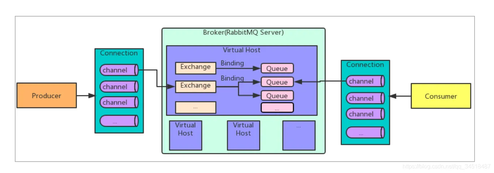

### 实际上RabbitMQ工作模型就是==生产者消费者模型==

### 两个客户端：

生产者发送消息，消费者接收消息

### Broker：

其实就是RabbitMQ服务器

### Queue:

可以理解为消息仓库，本质是队列

### channel:

信道，一个connection可以有多个channel,一个Broker可以有多个虚拟主机

### Exchange:

交换机，消息发送到RebbitMQ服务器（Broker）优先通过交换机分发/路由“消息“（业务数据）给”消息“key标签对应的一个或者两个队列，未匹配到则退回，自行处理（丢掉）