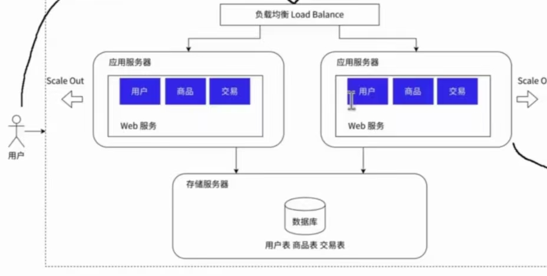
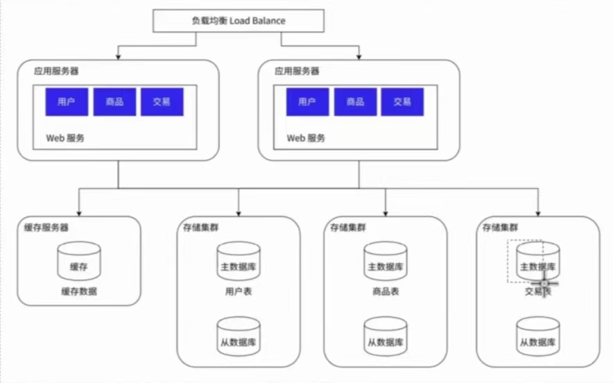
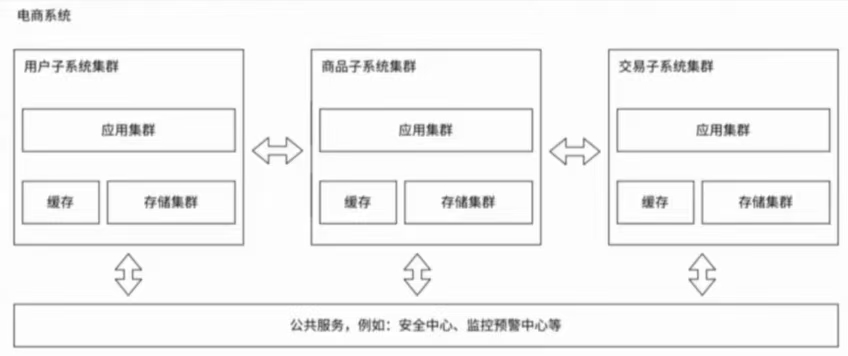

### 应用服务器：
包含很多业务逻辑，吃cpu，内存
### 存储服务器：
也可以说是数据库服务器，需要更大的硬盘空间，更快的访问速度

### 为什么引入更多的应用服务器节点？

由于应用服务器很吃cpu,内存，一般通过引入多个服务器节点来解决服务器压力较大的问题

如图
用户的请求一般会先到达负载均衡服务器，由该服务器把请求分别发送给应用服务器

### 所以到底什么是负载均衡服务器？他到底做了什么？他为什么能顶住这么多请求？

负载均衡器只负责分配任务，不负责执行任务
如果负载均衡器还是顶不住了，就会再引入负载均衡服务器（引入多个机房）

把数据库服务器分为主（写）和从（读），一般读的频率较高，所以从服务器会比较多，同时从数据库也会通过负载均衡的方式来让应用服务器访问

## 数据库读写分离

把数据库存储服务器分为主（写）和从（读），由于需要读的场景的频率较高，所以从数据库服务器一般为多个，同时也通过负载均衡的方式来处理应用服务器的请求

## 引入缓存

数据可以简单分为热数据和冷数据，热数据就是经常被访问的数据，这些数据我们可以放到缓存中，专门设置一个缓存服务器，虽然但是，其他数据库服务器仍然存储完整的数据，包括热点数据在内，它有效减少了其他数据库服务器的压力，缓存服务器的优势在于它的访问读取速度非常快，同时也存在数据存储空间较小的缺点

Redis通常就是作为缓存服务器使用！！！！！！

## 分库分表

一般情况下一个数据库服务器有多个数据库（create database）,现在通过引入多个数据库服务器，让一个服务器存储一个或者一部分数据库

如果某个表特别大也可以针对表进行拆分，具体如何分还得结合实际业务场景
### 业务决定了技术！！！

## 引入微服务

如果一个服务器里做了很多复杂的业务，之后的时间里这个服务器的代码只会越来越复杂，为了方便维护，可以把这样一个复杂的服务器拆成功能单一，但是更小的服务器
