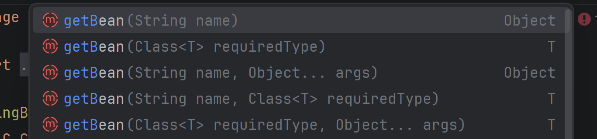

## 1 类注解

@Controller, @Service, @Repository, @Conponent, @Configration
### 1.1 @Controller

有以下添加了@Controller的代码
```java
@Controller  
public class UserController {  
    public void hello(){  
        System.out.println("hello");  
    }  
}
```
通过此代码来验证@Controller会把对象交给Spring，Spring可以帮助我们调用
```java
@SpringBootApplication  
public class SpringIocDemoApplication {  
  
    public static void main(String[] args) {  
        //此代码为了验证Controller把对象交给了Spring  
    ApplicationContext context = SpringApplication  
            .run(SpringIocDemoApplication.class, args);  
        //从应用上下文去拿到UserController  
    UserController bean = context.getBean(UserController.class);  
    bean.hello();  
    }  
  
}
```

其实获取bean有多种方法



这里String name就是bean的名称

#### Bean的名称

(1) 默认是类名的小驼峰写法 bookInfo
(2) 特殊情况下有些Bean的名称为类名，比如UController

如此我们可以通过名称获取bean

```java
@SpringBootApplication  
public class SpringIocDemoApplication {  
  
    public static void main(String[] args) {  
        //此代码为了验证Controller  
    ApplicationContext context = SpringApplication  
            .run(SpringIocDemoApplication.class, args);  
        //从应用上下文去拿到UserController  
        //根据类名去拿  
    UserController bean = context.getBean(UserController.class);  
    bean.hello();  
        //根据名称去拿  
     UserController userController = (UserController) context  
             .getBean("userController");  
    }  
  
}
```

根据类名和名字去拿

```java
@SpringBootApplication  
public class SpringIocDemoApplication {  
  
    public static void main(String[] args) {  
        //此代码为了验证Controller  
    ApplicationContext context = SpringApplication  
            .run(SpringIocDemoApplication.class, args);  
        //从应用上下文去拿到UserController  
        //根据类名去拿  
    UserController bean = context.getBean(UserController.class);  
    bean.hello();  
        //根据名称去拿  
     UserController userController = (UserController) context  
             .getBean("userController");  
        //根据对象名称和类名去拿  
     UserController userController1 = context  
             .getBean("userController",UserController.class);  
    }  
      
}
```

此三种方法得到的对象是同一个，同时验证了Spring对于Bean的管理*默认*用到的是==单例模式==！！！！

由于第一种通过一个类获取可以有多个Bean,所以第一种仅凭类名来获取存在局限性

---

## 2 方法注解
@Bean