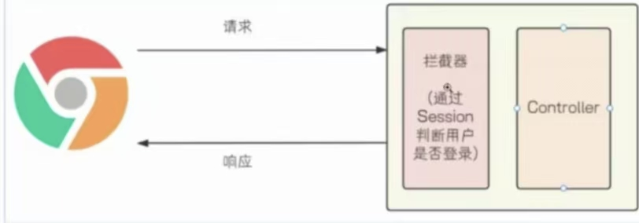
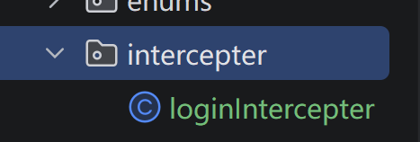

建拦截器包



实现HandlerIntercepter接口

```java
public class loginIntercepter implements HandlerInterceptor {  
  
}
```

观察HandlerInterceptor源码

```java
public interface HandlerInterceptor {  
//目标方法前执行预设业务逻辑
    default boolean preHandle(HttpServletRequest request, HttpServletResponse response, Object handler) throws Exception {  
        return true;  
    }  
//目标方法后执行预设业务逻辑
    default void postHandle(HttpServletRequest request, HttpServletResponse response, Object handler, @Nullable ModelAndView modelAndView) throws Exception {  
    }  
//视图渲染之后执行预设业务逻辑
    default void afterCompletion(HttpServletRequest request, HttpServletResponse response, Object handler, @Nullable Exception ex) throws Exception {  
    }  
}
```


创建配置类注册拦截器

```java
public class WebConfig implements WebMvcConfigurer {  
    @Override  
    public void addInterceptors(InterceptorRegistry registry) {  
        registry.addInterceptor(new loginIntercepter()).addPathPatterns("/**");  
    }  
}
```

第二种写法

```java
@Configuration  
@Slf4j  
public class WebConfig implements WebMvcConfigurer {  
    @Autowired  
    private LoginIntercepter loginIntercepter;  
    @Override  
    public void addInterceptors(InterceptorRegistry registry) {  
        //**表示所有路径  
        log.info("拦截器注册成功");  
        registry.addInterceptor(loginIntercepter).addPathPatterns("/**");  
    }  
}
```

完整拦截功能的实现

```java
@Component  
@Slf4j  
public class LoginIntercepter implements HandlerInterceptor {  
    @Autowired  
    private ObjectMapper objectMapper;  
  
    @Override  
    public boolean preHandle(HttpServletRequest request, HttpServletResponse response, Object handler) throws Exception {  
        // true表示放行，false表示拦截  
        log.info("执行preHandle");  
  
        //response设计到中文可能会出现乱码最好设置一下编码  
        response.setContentType("application/json;charset=utf-8");  
        //response.setCharacterEncoding("utf-8");  
  
        //加上true参数表示如果session不存在自动创建空的session  
        HttpSession session = request.getSession(false);  
  
        //用户已经登录  
  
        if(session!=null && StringUtils.hasLength((String)session.getAttribute(Constants.SESSION_USER_NAME))){  
            log.info("用户已登录");  
            return true;  
        }  
  
        //用户未登录  
  
        log.warn("用户尚未登陆");  
        Result result = Result.unlogin();  
        response.getOutputStream().write(objectMapper.writeValueAsBytes(result));  
        //response.getOutputStream().write(objectMapper.writeValueAsString(result).getBytes());  
  
        //设置http状态码  
        response.setStatus(401);  
            return false;  
    }  
    @Override  
    public void postHandle(HttpServletRequest request, HttpServletResponse response, Object handler, @Nullable ModelAndView modelAndView) throws Exception {  
        log.info("");  
    }  
}
```

拦截路径设置

/* 一级路径
/** 任意级路径
/book/* book目录下一级路径
/book/** book目录下任意路径

排除部分路径

```java
@Configuration  
@Slf4j  
public class WebConfig implements WebMvcConfigurer {  
  
    private List<String> excludePath = Arrays.asList("/user/login","/**/*.html","/css/**","/js/**","/pic/**");  
  
    @Autowired  
    private LoginIntercepter loginIntercepter;  
      
    @Override  
    public void addInterceptors(InterceptorRegistry registry) {  
        //**表示所有路径  
        log.info("拦截器注册成功");  
        registry.addInterceptor(loginIntercepter).addPathPatterns("/**").excludePathPatterns(excludePath);  
    }  
}
```