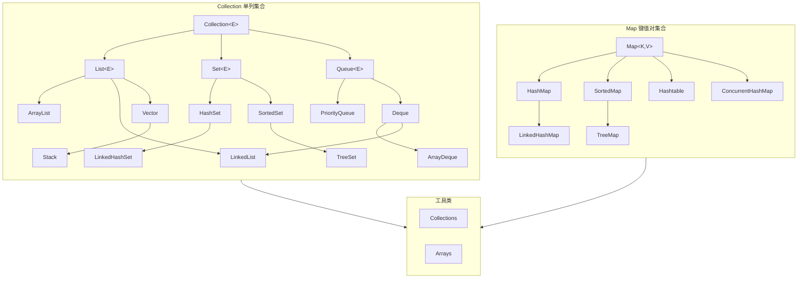

## 1  全景图


---

## 2、两大根接口

### 2.1. **Collection（单列集合）**
存储**单个元素**的集合，有三个主要子接口：
- **List**：有序、可重复
- **Set**：无序、不可重复  
- **Queue**：队列，特殊的线性表

### 2.2. **Map（键值对集合）**
存储**键值对**的集合，键不可重复

---

## 3、Collection 接口体系详解

### 3.1. **List（列表）- 有序可重复**
```java
// List 的主要实现类对比
List<String> arrayList = new ArrayList<>();   // 动态数组，查询快
List<String> linkedList = new LinkedList<>(); // 双向链表，增删快
List<String> vector = new Vector<>();         // 线程安全的动态数组（已过时）
```

**特点对比：**
| 特性 | ArrayList | LinkedList | Vector |
| 底层结构 | 动态数组 | 双向链表 | 动态数组 |
| 线程安全 | 否 | 否 | **是** |
| 随机访问 | O(1) | O(n) | O(1) |
| 头部插入 | O(n) | **O(1)** | O(n) |
| 内存占用 | 少（连续） | 多（节点开销） | 少 |

### 3.2. **Set（集合）- 无序不可重复**
```java
Set<String> hashSet = new HashSet<>();           // 哈希表，无序
Set<String> linkedHashSet = new LinkedHashSet<>(); // 保持插入顺序
Set<String> treeSet = new TreeSet<>();           // 红黑树，自然排序
```

**实现原理：**
- **HashSet**：基于 HashMap 实现，使用哈希表存储
- **LinkedHashSet**：继承 HashSet，使用链表维护插入顺序
- **TreeSet**：基于 TreeMap 实现，红黑树结构，支持排序

### 3.3. **Queue（队列）- 先进先出**
```java
Queue<String> queue = new LinkedList<>();     // 普通队列
Queue<Integer> pq = new PriorityQueue<>();    // 优先级队列
Deque<String> deque = new ArrayDeque<>();     // 双端队列
```

**主要实现：**
- **LinkedList**：可作队列、双端队列、列表
- **ArrayDeque**：数组实现的双端队列，性能更好
- **PriorityQueue**：优先级队列（堆实现）

---

## 4、Map 接口体系详解

### Map 主要实现类
```java
Map<String, Integer> hashMap = new HashMap<>();         // 最常用，无序
Map<String, Integer> linkedHashMap = new LinkedHashMap<>(); // 保持插入顺序
Map<String, Integer> treeMap = new TreeMap<>();         // 按键排序
Map<String, Integer> hashtable = new Hashtable<>();     // 线程安全（已过时）
Map<String, Integer> concurrentMap = new ConcurrentHashMap<>(); // 并发安全
```

### HashMap 核心原理（面试题）
```java
// HashMap 的简单工作流程
Map<String, String> map = new HashMap<>();
map.put("key", "value");  // 1.计算key的hashCode
                          // 2.通过hash计算数组下标
                          // 3.解决哈希冲突（链表/红黑树）
```

**JDK 8+ HashMap 重要特性：**
1. **数组 + 链表 + 红黑树**
2. **扩容机制**：默认容量16，负载因子0.75，扩容2倍
3. **树化条件**：链表长度 ≥ 8 且数组长度 ≥ 64
4. **退化条件**：树节点 ≤ 6 时退化为链表

### LinkedHashMap vs TreeMap
| 特性   | LinkedHashMap     | TreeMap                   |
| ---- | ----------------- | ------------------------- |
| 底层结构 | 哈希表+双向链表          | 红黑树                       |
| 顺序   | **插入顺序**或**访问顺序** | **键的自然顺序**或**Comparator** |
| 性能   | O(1) 访问           | O(log n) 访问               |
| 线程安全 | 否                 | 否                         |

---

## 5、线程安全的集合

### 5.1. **旧的线程安全类（不推荐）**
- **Vector**、**Stack**、**Hashtable**
- 问题：所有方法都用 `synchronized` 修饰，性能差

### 5.2. **使用 Collections 工具类包装**
```java
List<String> syncList = Collections.synchronizedList(new ArrayList<>());
Map<String, String> syncMap = Collections.synchronizedMap(new HashMap<>());
```

### 5.3. **JUC（java.util.concurrent）包下的并发集合**
```java
// 并发安全的集合
ConcurrentHashMap<String, Integer> chm = new ConcurrentHashMap<>();
CopyOnWriteArrayList<String> cowList = new CopyOnWriteArrayList<>();
CopyOnWriteArraySet<String> cowSet = new CopyOnWriteArraySet<>();
ConcurrentLinkedQueue<String> clq = new ConcurrentLinkedQueue<>();
```

**CopyOnWriteArrayList 原理：**
- **写时复制**：修改时复制整个数组，在新数组上操作
- **适用场景**：读多写少，数据量不大
- **缺点**：内存占用大，写操作性能差

---

## 6、集合工具类

### 6.1. **Collections 工具类**
```java
// 常用操作
Collections.sort(list);                    // 排序
Collections.reverse(list);                 // 反转
Collections.shuffle(list);                 // 随机打乱
Collections.binarySearch(list, key);       // 二分查找
Collections.max(collection);               // 最大值
Collections.min(collection);               // 最小值

// 创建不可变集合（Java 9+）
List<String> immutableList = List.of("A", "B", "C");
Set<String> immutableSet = Set.of("A", "B");
Map<String, Integer> immutableMap = Map.of("A", 1, "B", 2);
```

### 6.2. **Arrays 工具类**
```java
// 数组与集合转换
String[] array = {"A", "B", "C"};
List<String> list = Arrays.asList(array);  // 固定大小列表
String[] newArray = list.toArray(new String[0]);

// 数组操作
Arrays.sort(array);
Arrays.binarySearch(array, "B");
Arrays.fill(array, "X");
Arrays.equals(array1, array2);
```

---

## 7、选择集合的黄金法则

### 如何选择正确的集合？
1. **是否需要键值对？**
   - 是 → **Map**
     - 需要排序 → **TreeMap**
     - 需要插入顺序 → **LinkedHashMap**
     - 只需要快速查找 → **HashMap**
     - 需要线程安全 → **ConcurrentHashMap**
   - 否 → **Collection**

2. **Collection 如何选？**
   - 允许重复？
     - 是 → **List**
       - 查询多，增删少 → **ArrayList**
       - 增删多，查询少 → **LinkedList**
       - 需要线程安全 → **CopyOnWriteArrayList**
     - 否 → **Set**
       - 需要排序 → **TreeSet**
       - 需要插入顺序 → **LinkedHashSet**
       - 只需要去重 → **HashSet**

3. **需要队列特性？**
   - 普通队列 → **LinkedList** 或 **ArrayDeque**
   - 优先级队列 → **PriorityQueue**
   - 线程安全队列 → **ConcurrentLinkedQueue**

---

## 8、最佳实践和注意事项

### 8.1. **初始化容量**
```java
// 避免频繁扩容，提升性能
List<String> list = new ArrayList<>(1000);      // 预分配容量
Map<String, String> map = new HashMap<>(16, 0.75f);
```

### 8.2. **遍历集合的正确方式**
```java
// 1. 增强for循环（推荐）
for (String item : list) { }

// 2. 迭代器（可在遍历时删除）
Iterator<String> it = list.iterator();
while (it.hasNext()) {
    if (condition) it.remove();  // 安全删除
}

// 3. forEach + Lambda（Java 8+）
list.forEach(item -> System.out.println(item));

// 4. 并行流（大数据量）
list.parallelStream().forEach(item -> { });
```

### 8.3. **重要注意事项**
```java
// 1. 正确实现 equals() 和 hashCode()（用于HashMap/HashSet）
// 2. 实现 Comparable 或提供 Comparator（用于TreeMap/TreeSet）
// 3. 不要在遍历时修改集合（除了使用Iterator.remove()）
// 4. 注意集合的线程安全性
// 5. 使用泛型保证类型安全
```

### 8.4. **性能考量**
```java
// 时间复杂度参考
集合操作           ArrayList  LinkedList  HashMap  TreeMap
-----------------------------------------------------------
get(index/key)     O(1)       O(n)        O(1)     O(log n)
add/put            O(1)*      O(1)        O(1)*    O(log n)
remove             O(n)       O(1)        O(1)*    O(log n)
contains           O(n)       O(n)        O(1)     O(log n)

* 均摊时间复杂度，考虑扩容因素
```

---

## 9、Java 8+ 新特性

### Stream API 操作集合
```java
List<String> result = list.stream()
    .filter(s -> s.startsWith("A"))
    .map(String::toUpperCase)
    .sorted()
    .collect(Collectors.toList());
```

### 不可变集合工厂方法
```java
// Java 9 引入
List<String> list = List.of("a", "b", "c");
Set<String> set = Set.of("a", "b", "c");
Map<String, Integer> map = Map.of("a", 1, "b", 2);
```

---
