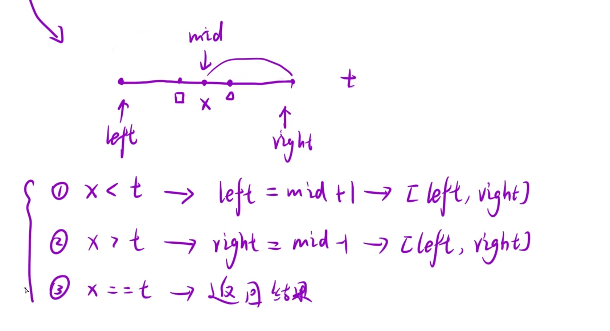

## 算法原理

大多用于数组有序的情况（二段性-可分两部分），无序情况找规律也能用二分查找

## 模板

1.基础模板

结束条件 left > right的时候结束，left<=right的时候循环一致继续 “=” 的时候不确定找到了，但是如果 left > right 循环一定结束了

2.查找左边界模板

3.查找有边界模板
### 1 在排序数组中查找元素的第一个和最后一个位置
https://leetcode.cn/problems/find-first-and-last-position-of-element-in-sorted-array/description/

